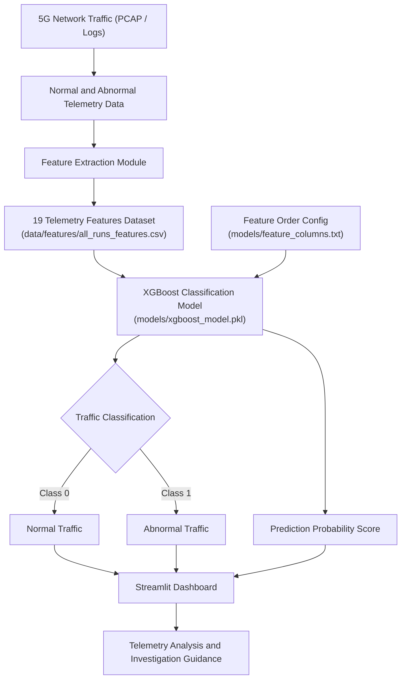
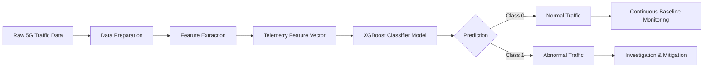
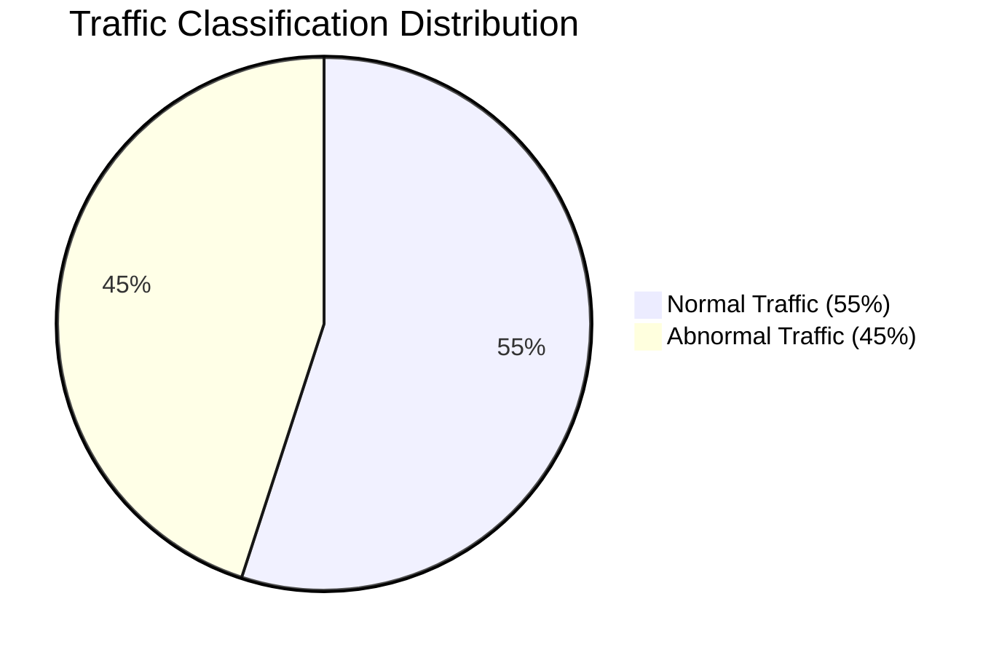
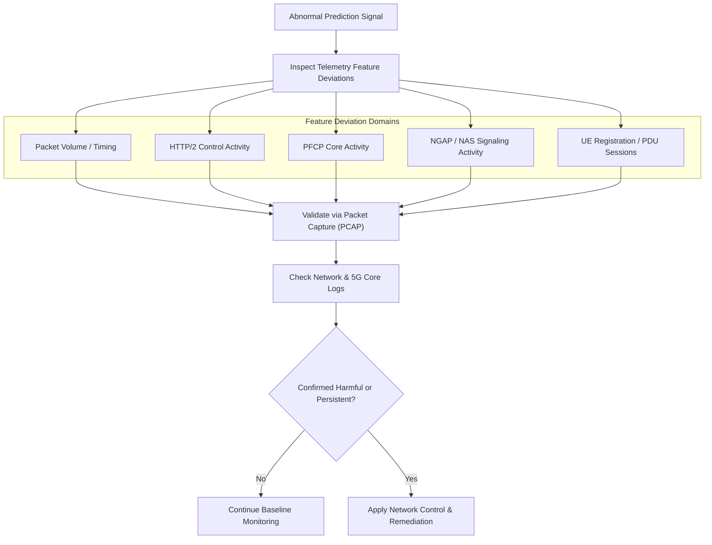
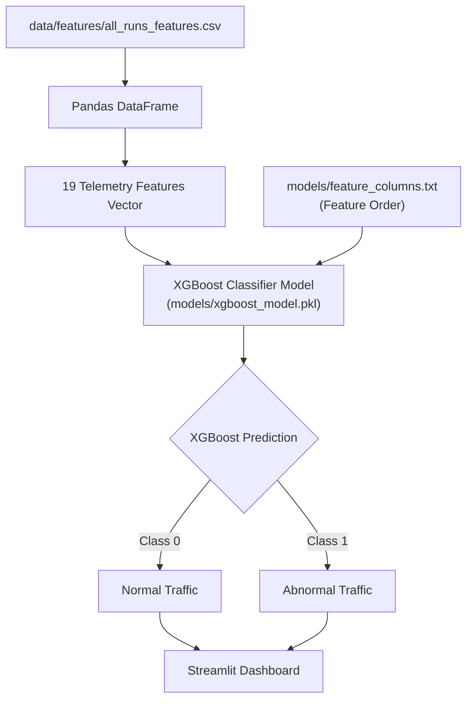
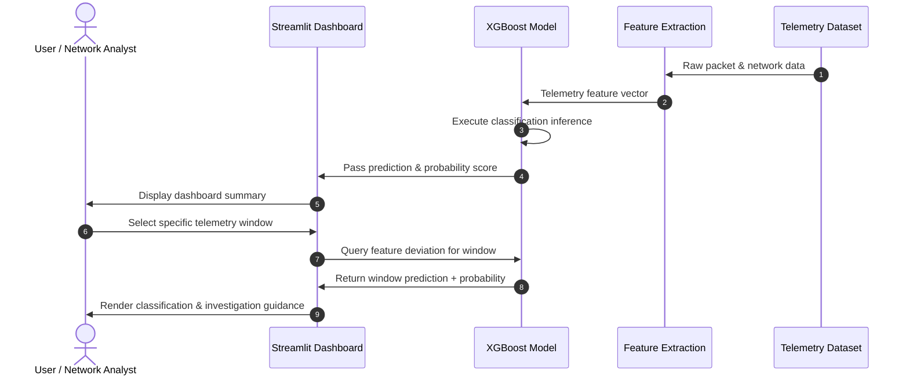

# 5G Network Anomaly Detection Using XGBoost-Based Telemetry Analysis

A machine-learning-based 5G network anomaly detection system that extracts telemetry features from network traffic and classifies telemetry windows as **Normal** or **Abnormal** using an **XGBoost classifier**.

The project also includes a Streamlit dashboard for telemetry analysis, feature importance, anomaly detection, dataset inspection, class statistics, and network assessment.

---

## Project Overview

5G networks generate large volumes of packet, protocol, signaling, and timing information. The project converts this raw network activity into structured telemetry features and uses machine learning to identify deviations from normal traffic behavior.

The system performs the following operations:

1. Collects network traffic and telemetry data.
2. Separates normal and abnormal traffic samples.
3. Extracts packet, protocol, signaling, and timing features.
4. Builds a feature dataset for machine learning.
5. Loads a trained XGBoost classification model.
6. Classifies telemetry windows as Normal or Abnormal.
7. Calculates class statistics and model-fit accuracy.
8. Presents the results through an interactive Streamlit dashboard.
9. Provides investigation guidance for abnormal telemetry windows.

---

## Problem Statement

Manual inspection of 5G network traffic becomes difficult when packet volume, signaling activity, protocol counts, and timing behavior change across many telemetry windows.

This project uses machine learning to identify these changes automatically. The XGBoost model receives telemetry-derived features and predicts whether a telemetry window belongs to the normal or abnormal class.

An abnormal prediction is treated as a detection signal that should be investigated using telemetry, network logs, and packet captures. It does not by itself prove that an attack has occurred.

---

## Key Features

- 5G network telemetry analysis
- Normal and abnormal traffic classification
- XGBoost-based machine-learning classifier
- Packet-level feature extraction
- Protocol activity analysis
- 5G signaling activity analysis
- Packet timing and inter-arrival analysis
- Feature importance analysis
- Individual telemetry-window prediction
- Abnormal probability estimation
- Dataset inspection
- Network assessment and remediation guidance
- Interactive Streamlit dashboard

---

## System Architecture

The following architecture represents the implemented project flow.



### Architecture Components

| Component | Purpose |
|---|---|
| Network Traffic | Source packet captures and network traffic data |
| Normal / Abnormal Data | Classification-specific traffic samples |
| Feature Extraction | Converts packet and signaling activity into numerical telemetry |
| Feature Dataset | Stores extracted telemetry features |
| 19 Telemetry Features | Input variables supplied to the classifier |
| XGBoost Model | Predicts Normal or Abnormal traffic |
| Feature Columns | Defines the model input feature order |
| Streamlit Dashboard | Provides visualization and interactive analysis |
| Anomaly Detection | Classifies an individual telemetry window |
| Investigation Guidance | Helps investigate feature deviations and abnormal activity |

---

## Machine Learning Pipeline



---

## Telemetry Features

The feature dataset contains packet, protocol, signaling, and timing measurements.

| Feature | Description |
|---|---|
| `packet_count` | Number of packets in the telemetry window |
| `mean_packet_length` | Average packet length |
| `max_packet_length` | Maximum packet length |
| `min_packet_length` | Minimum packet length |
| `std_packet_length` | Standard deviation of packet length |
| `tcp_count` | TCP packet count |
| `udp_count` | UDP packet count |
| `sctp_count` | SCTP packet count |
| `http2_count` | HTTP/2 activity count |
| `pfcp_count` | PFCP activity count |
| `ngap_count` | NGAP activity count |
| `icmp_count` | ICMP packet count |
| `mongo_count` | MongoDB-related packet count |
| `initial_ue_count` | Initial UE signaling count |
| `uplink_nas_count` | Uplink NAS signaling count |
| `pdu_setup_req_count` | PDU session setup request count |
| `pdu_setup_resp_count` | PDU session setup response count |
| `ue_release_count` | UE release activity count |
| `mean_interarrival_ms` | Mean packet inter-arrival time |

The dataset also contains the `label` field, which represents the traffic class.

---

## Dataset Classification

The current dashboard reports 100 telemetry windows.

| Classification | Windows | Percentage |
|---|---:|---:|
| Normal | 55 | 55.00% |
| Abnormal | 45 | 45.00% |
| **Total** | **100** | **100.00%** |

### Classification Diagram



---

## Model Results

| Metric | Result |
|---|---:|
| Total telemetry windows | 100 |
| Normal windows | 55 |
| Abnormal windows | 45 |
| Abnormal rate | 45.00% |
| Telemetry features | 19 |
| Dataset-fit accuracy | 94.0% |

> **Important:** The 94.0% value is the accuracy calculated on the available dataset by applying the loaded model to that dataset. It should not be described as independent test accuracy unless a separate held-out test set is used.

---

## Dashboard

The Streamlit application contains the following sections:

### 1. Overview

Provides:

- Total telemetry windows
- Normal windows
- Abnormal windows
- Dataset-fit accuracy
- Normal vs abnormal percentage visualization
- Class statistics
- Detection context
- Network assessment

### 2. Telemetry Analysis

Allows inspection of telemetry values and comparison of network behavior across windows.

### 3. Feature Importance

Displays the contribution of telemetry features to the XGBoost model.

### 4. Anomaly Detection

A telemetry window can be selected and passed through the trained model.

The dashboard reports:

- Model prediction
- Abnormal probability
- Actual label
- Selected telemetry values
- Feature deviations
- Investigation recommendations

### 5. Dataset

Displays the extracted telemetry feature dataset used by the dashboard.

---

## Abnormal Traffic Investigation

When a telemetry window is classified as abnormal, the dashboard provides investigation guidance based on the detected feature deviations.



### Investigation Steps

#### 1. Validate the Event

Check the corresponding telemetry window, packet capture, timestamp, and network logs.

#### 2. Identify the Source

Inspect:

- UE registration activity
- NAS signaling
- NGAP activity
- PDU session activity
- PFCP traffic
- HTTP/2 control-plane activity
- Packet bursts and timing changes

#### 3. Apply the Response

If the deviation is confirmed as harmful or persistent, apply the appropriate network-control response and continue monitoring the telemetry trend.

---

## Project Structure

The repository should be organized so that the data, model, dashboard, documentation, and supporting files are clearly separated.

```text
5G-Network-Anomaly-Detection-Using-XGBoost-Based-Telemetry-Analysis/
├── data/
│   ├── normal/
│   │   ├── run_01/
│   │   ├── run_02/
│   │   └── ...
│   ├── abnormal/
│   │   ├── registration_burst/
│   │   ├── registration_burst_02/
│   │   ├── registration_burst_03/
│   │   └── ...
│   └── features/
│       ├── normal_features.csv
│       ├── abnormal_features.csv
│       └── all_runs_features.csv
├── models/
│   ├── xgboost_model.pkl
│   └── feature_columns.txt
├── dashboard/
│   └── app.py
├── documentation/
│   ├── architecture/
│   ├── methodology/
│   └── reports/
├── requirements.txt
├── README.md
└── LICENSE
```

> Keep the structure consistent with the actual repository files. Do not create empty folders unless they are needed by the project.

---

## Technologies Used

| Technology | Purpose |
|---|---|
| Python | Data processing and application development |
| XGBoost | Traffic classification |
| Pandas | Dataset processing |
| NumPy | Numerical operations |
| Scikit-learn | Machine-learning utilities and evaluation |
| Joblib | Model serialization and loading |
| Matplotlib | Data visualization |
| Streamlit | Interactive dashboard |
| PCAP / Wireshark data | Network traffic source |
| Git / GitHub | Version control and project hosting |

---

## Application Data Flow

The Streamlit dashboard loads the project data and trained model using the following files:



The feature order is read from:

```text
models/feature_columns.txt
```

The model is loaded from:

```text
models/xgboost_model.pkl
```

---

## Installation

Create a Python environment and install the project dependencies.

### Windows

```bash
python -m venv venv
venv\Scripts\activate
pip install -r requirements.txt
```

### Linux / macOS

```bash
python3 -m venv venv
source venv/bin/activate
pip install -r requirements.txt
```

---

## Run the Dashboard

From the repository root:

```bash
streamlit run dashboard/app.py
```

The application loads:

```text
data/features/all_runs_features.csv
models/xgboost_model.pkl
models/feature_columns.txt
```

Make sure these paths match the files in your repository before running the application.

---

## Model Workflow



---

## Network Assessment

### Normal Traffic

The normal class contains 55 telemetry windows, representing 55.0% of the available dataset.

Typical interpretation:

- Feature values remain closer to the observed normal distribution.
- Protocol and 5G signaling activity is comparatively less pronounced.
- Future telemetry windows can be compared against the normal baseline.
- Continued monitoring is appropriate when model probability remains low.

### Abnormal Traffic

The abnormal class contains 45 telemetry windows, representing 45.0% of the available dataset.

Potential indicators include:

- Increased packet volume
- Changes in packet-size statistics
- Increased HTTP/2 activity
- Increased PFCP activity
- Increased NGAP activity
- Increased UE registration or NAS signaling
- Shorter packet inter-arrival times
- Increased PDU session signaling

An abnormal classification should be investigated with packet captures and network logs before taking corrective action.

---

## Interpretation Boundary

The feature-deviation analysis describes how a selected telemetry window differs from the observed normal dataset.

The XGBoost probability is the model output.

An abnormal prediction alone does not establish:

- That an attack occurred
- The root cause of the traffic
- That the traffic is malicious
- That a specific network component is responsible

Packet captures, network logs, and operational context should be used for confirmation.

---

## Limitations

- The reported 94.0% accuracy is dataset-fit accuracy.
- Independent test-set performance should be reported separately.
- The available dataset may not represent every real-world 5G traffic condition.
- Anomaly detection is dependent on the quality and coverage of the training data.
- Network behavior can change over time.
- A model prediction does not by itself establish malicious activity.
- Real-time deployment requires continuous telemetry ingestion and operational monitoring.

---

## Future Improvements

1. Add independent training, validation, and test datasets.
2. Report precision, recall, F1-score, confusion matrix, and ROC-AUC.
3. Add real-time telemetry ingestion.
4. Add live anomaly alerts.
5. Add historical anomaly tracking.
6. Add automated PCAP correlation.
7. Add model retraining for newly collected telemetry.
8. Add SHAP-based model explainability.
9. Add deployment and monitoring for continuous inference.
10. Evaluate the model on a larger and more diverse 5G traffic dataset.

---

## License

MIT License. See [LICENSE](LICENSE).

---

## Team

Built by a team of three for **21IPE403J** at **SRM Institute of Science and Technology**.

| Name | Registration No. |
|---|---|
| Agnihotram Chinmayanand | RA2311053010116 |
| Sakthivel B | RA2311053010126 |
| Swayam Dashputre | RA2311067010011 |

---

## Repository

[5G Network Anomaly Detection Using XGBoost-Based Telemetry Analysis](https://github.com/Chinmayanand03/5G-Network-Anomaly-Detection-Using-XGBoost-Based-Telemetry-Analysis)
